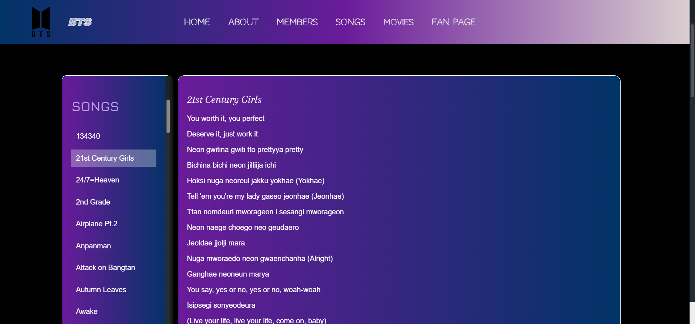
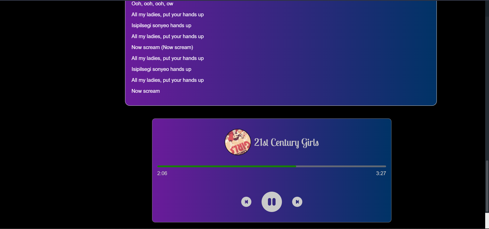

# BTS Website

Welcome to the BTS website! This project is dedicated to providing information about BTS, including member details, awards, albums, and a music page
where you can explore and listen to their songs. Additionally, there's a chat page for ARMY to share their thoughts.

## Table of Contents

- [Features](#features)
- [Technologies Used](#technologies-used)
- [Getting Started](#getting-started)
- [Installation](#installation)
- [Usage](#usage)
- [Database Configuration](#database-configuration)
- [Contributing](#contributing)

## Features

1. **Main Page:**
   - Information about BTS.
   - Member details.
   - Awards owned by BTS.
   - List of BTS albums.
   
   
   

2. **Music Page:**
   - List of BTS songs.
   - Song lyrics display.
   - Music playback feature.
   
   
   

3. **Chat Page:**
   - Chat room for ARMY to share their views.
   - Real-time communication.
   
   

## Technologies Used

- React.js
- Express.js
- MySQL
- Other technologies you've used

## Getting Started

To get a local copy of the project up and running, follow the instructions below.

## Installation

1. Clone the repository:
   git clone https://github.com/KierthanaRS/BTS.git
   cd bts-website
Install dependencies:
  npm install
  Usage
Start the React development server:
    cd client
    npm start
This will run the React app on http://localhost:3000.

Start the Express server:

  cd server
  npm start
This will start the Express server on http://localhost:5000.

## Database Configuration
Configure the MySQL database connection in the server/db.js file.
// server/db.js

const dbConfig = {
  host: 'your-database-host',
  user: 'your-database-user',
  password: 'your-database-password',
  database: 'bts_database',
};

module.exports = dbConfig;

## Contributing
Contributions are welcome! Feel free to open issues or submit pull requests.
